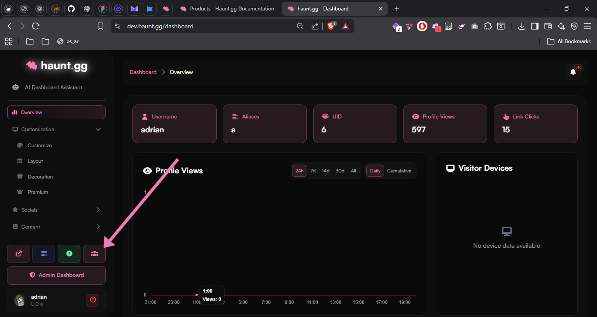
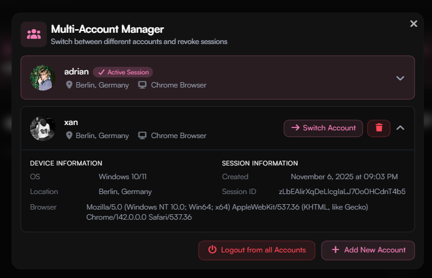

<Card title="Multiaccounting Policy" icon="circle-1" href="../guides/multiaccounting#multiaccounting-policy" horizontal>
Learn more about the multiaccounting policy.
</Card>

<Card title="Creating multiple accounts" icon="circle-2" href="../guides/multiaccounting#creating-multiple-accounts" horizontal>
Learn how to create multiple accounts on haunt.gg.
</Card>

<Card title="Unban previously banned accounts" icon="circle-3" href="../guides/multiaccounting#unban-previously-banned-accounts" horizontal>

Learn how to unban previously banned accounts.
</Card>

## Multiaccounting policy

<Note>
Multiaccounting is allowed with limitations.
</Note>

| Free                         | Premium on main account           |
| ---------------------------- | --------------------------------- |
| Create up to **3 accounts**  | Create up to **5 accounts**       |

- The profiles must be active, like having customizations, links, etc.
- We reserve the right to ban accounts that do not meet the requirements.

---

## Creating multiple accounts

Multiple accounts can be easily created by [registering](https://haunt.gg/register) with a different email address.  
Our system will automatically detect if you have multiple accounts.

---

## Multi-Account Manager

The **Multi-Account Manager** allows you to manage multiple Haunt accounts using a single browser.

<Steps>
<Step title="Open the Multi-Account Manager">
Open the [**dashboard**](https://haunt.gg/dashboard) and click the **Multi-Account Manager** button.
<Frame>

</Frame>
</Step>

<Step title="Interface">
In the interface, you can add accounts, log out of accounts, switch between accounts, and view session information.
<Frame>

</Frame>
</Step>
</Steps>

---

## Unban previously banned accounts

<Info>
Our **Multiaccounting Policy** changed on `5 August 2025`.  
This means old accounts that didn’t follow the policy can now be **unbanned on request**.
</Info>

<Update label="Old Policy">
    By using haunt.gg you agree **NOT** to:
    - Create multiple accounts, except your own premium or verified account, on every account.
</Update>

You can request an unban of your account by contacting us on [Discord](https://discord.gg/hauntbio).
