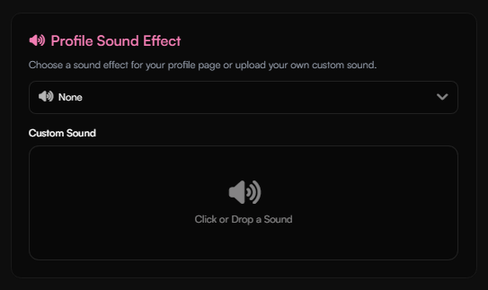

<script dangerouslySetInnerHTML={{
  __html: `
    (function() {
      let isToggling = false;
      
      document.addEventListener('click', function(e) {
        const summary = e.target.closest('summary');
        if (summary && !isToggling) {
          const clickedAccordion = summary.parentElement;
          const wasOpen = clickedAccordion.hasAttribute('open');
          
          isToggling = true;
          
          if (!wasOpen) {
            const allAccordions = document.querySelectorAll('details[open]');
            allAccordions.forEach(accordion => {
              if (accordion !== clickedAccordion) {
                accordion.removeAttribute('open');
              }
            });
          }
          
          requestAnimationFrame(() => {
            isToggling = false;
          });
        }
      });
    })();
  `
}} />

<Card title="Buy Premium" icon="circle-1" href="../guides/premium#how-to-buy-premium-on-haunt-gg" horizontal>
Learn how to buy premium on haunt.gg
</Card>

<Card title="Payment Methods" icon="circle-2" href="../overview/products#payment-methods" horizontal>
Check out the available payment methods.
</Card>

<Card title="Premium Features" icon="circle-3" href="../guides/premium#premium-features" horizontal>
Check out all premium features.
</Card>

## How to buy Premium on haunt.gg

<Info>
Available payment methods can be found [here](../overview/products#payment-methods).
</Info>

<Steps>
    <Step title="Go to the pricing page">
        Head over to [haunt.gg/pricing](https://haunt.gg/pricing#premium)
    </Step>
    <Step title="Pick your payment method">
        Then pick your preferred payment method
    </Step>
</Steps>

---

## Premium Features

<AccordionGroup>
<Accordion title="Alias">
You receive an alias token after buying premium, [**learn more**](../overview/products#alias-token).
</Accordion>

<Accordion title="2 Character Username">
You can create a **2 character** username.  

<Frame>
    
</Frame>

</Accordion>

<Accordion title="Profile Metadata">
You can set your **Discord Embed**, **Tab Title**, and **Favicon** with Profile Metadata.  

<Frame>
    
</Frame>

<Frame>
    
</Frame>

### Metadata Preview (Discord)

<Frame>
    
</Frame>
</Accordion>

<Accordion title="Typewriter Descriptions">
You can add multiple descriptions to display on your Bio with a **Typewriter effect**.  

<Frame>
    
</Frame>

### Typewriter Effect Preview

<Frame>
    
</Frame>
</Accordion>

<Accordion title="Cursor Effects">
You can add a **custom cursor effect** that follows your mouse on your Bio.  

<Frame>
    
</Frame>

### Cursor Effect Preview

<Frame>
    
</Frame>
</Accordion>

<Accordion title="Font Settings">
You can change the **font** for your Bio page (including your name and description).  

<Frame>
    
</Frame>

### Font Preview

<Frame>
    
</Frame>
</Accordion>

<Accordion title="Profile Animation">
You can add a **custom animation** to your Bio page.  

<Frame>
    
</Frame>

### Profile Animation Preview

<Frame>
    
</Frame>
</Accordion>

<Accordion title="Profile Enter Animation">
You can add a **custom enter animation** to your Bio page.  

<Frame>
    
</Frame>

### Profile Enter Animation Preview

<Frame>
    
</Frame>
</Accordion>

<Accordion title="Profile Sound Effect">
You can add a **custom click sound effect** to your Bio page.  

<Frame>
    
</Frame>
</Accordion>

<Accordion title="Username Cooldown">
Premium removes the **username cooldown**, letting you change your username anytime.  

<Frame>
    
</Frame>
</Accordion>

<Accordion title="Customizable Border Options">
You can customize your border’s **animations**.  

<Frame>
    
</Frame>

### Animated Border Preview

<Frame>
    
</Frame>
</Accordion>

<Accordion title="Custom Fonts">
You can upload and use **custom fonts** on your Bio page (including your name and description).  

<Frame>
    
</Frame>
</Accordion>
</AccordionGroup>

---

## How do I get the premium rank on Discord?

<Note>
     You can learn more about how to link your rank to Discord in this guide: [Discord Connection](/guides/discord)
</Note>

